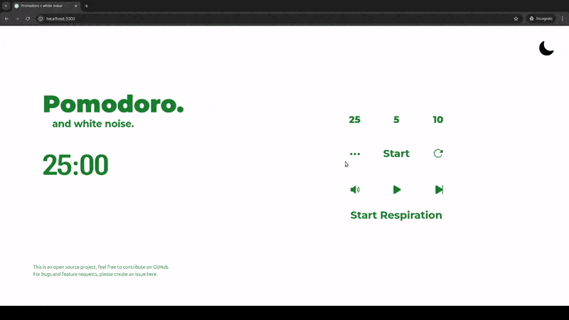
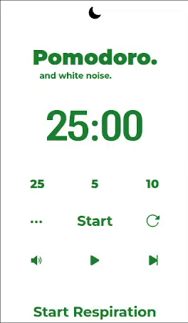

# Description

This project is a Pomodoro timer with a built-in white noise player. It uses Web Audio API to loop short audio files seamlessly and control the volume.

Feel free to try it out at: https://pomodoroandwhitenoise.com/

## Preview:





## After cloning:

### Run on node (node required)
```
$ npm install
$ npm run start
```

### Run on Docker (alternative)
```
$ docker build -t pomodoro-and-white-noise .
$ docker run -p 3000:3000 pomodoro-and-white-noise
```

## Known Bugs:

- For mobile devices, the audio stops playing when phone screen locks/turns off.
- In Firefox, the volume bar does not work and it may be due to autoplay policy in Firefox. To be fixed.
